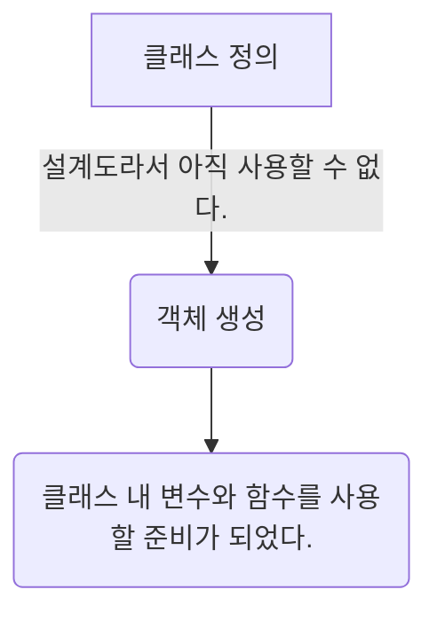

처음 자바를 배울 때 헷갈리는 개념 중 객체와 생성자는 스프링 프레임워크를 공부할 때도 여전히 자주 등장한다. 그래서 자바를 배울 때 명확하게 개념을 잡고 가지 않으면 추후 어려움을 겪게 된다. 프로그래밍을 시작한 사람 입장에서는 new 키워드와 constructor라고 작성된 단어로부터 알 수 없는 두려움을 느낄지도 모른다. 핵심만 같이 정리해 보면 조금 더 쉽게 이해할 수 있으리라고 믿는다.

### 객체는 무엇일까?
```
'컴퓨터 과학에서 클래스에서 정의한 것을 바탕으로 메모리에 할당된 데이터 또는 식별자를 가리키는 용어'
```

### 그렇다면 클래스는 무엇일까?
```
클래스는 설계도나 틀과 같은 역할을 한다.
```
```java
class Car {

}
```
유명한 예제로는 동물, 차, 계산기 등이 있다. 그리고 클래스가 가지는 속성은 변수로 나타나고 행위는 함수로 나타난다.
```java
class Car {
	// 속도와 색상이라는 차가 가진 속성
	private String color;
	private int speed;
	
	// 운전하다와 멈추다라는 차가 가진 행위
	public void drive() {
	
	}
	public void stop() {
	
	}
}
```

아마 여기까지는 대부분이 개념적으로 이해할 수 있을 것이다. 그렇다면 클래스로 분리해서 만든 `Car`를 사용하려면 어떻게 해야 할까? 클래스는 설계도나 틀과 같은 역할이므로 선언만 해서는 사용할 수 없다. 클래스를 사용하려면 객체로 만들어야 한다. 이때 나오는 용어가 '인스턴스'이다.

### 객체 생성은 무엇일까?
```
'클래스를 통해 실체화된 인스턴스'
```
설계도인 클래스가 메모리에 할당되어 객체가 되면 실제로 선언해놓은 변수나 함수를 다룰 수 있다.

```java
public void static main(String[] args) {
	Car newcar = new Car(); // new 키워드를 통해 객체 생성
}
```
정리해보면 아래와 같다.


그리고 new 키워드를 통해 사용하는 것은 우리가 만든 클래스에만 적용되는 법칙이 아니라 자바 전체에 해당하는 법칙이다. 예를 들면 학습에서 많이 사용하는 Scanner, ArrayList 심지어 String도 클래스이다. 단지 우리가 생성하지 않고 미리 만들어진 클래스일 뿐이다.

```java
public class ArrayList<E> extends AbstractList<E> implements List<E>, RandomAccess, Cloneable, java.io.Serializable {
	...
}

public final class String  
    implements java.io.Serializable, Comparable<String>, CharSequence,  
               Constable, ConstantDesc {
   ...
}

public final class Scanner implements Iterator<String>, Closeable {
	...
}
```

만약 인텔리제이를 사용한다면 `cmd + 마우스 좌클릭(control + 마우스 좌클릭)` 해서 실제 선언부에 들어가볼 수 있다. 우리가 호출해서 사용하는 데이터 타입이나 도구들이 클래스라는 것을 알 수 있다.

### 생성자란 무엇일까?
```
객체가 생성될 때 호출되어 초기화 작업을 수행하는 특수한 메서드
```

생성자를 보기 전에 함수 이야기를 잠시만 하겠다. 만약 아래와 같이 `printResult`라는 함수를 호출하고 싶다면 어떻게 해야 할까? 미리 정의되어 있어야 한다.
```java
public void static main(String[] args) {
	printResult(); // 에러 발생
}
```
그리고 `cmd + 마우스 좌클릭`을 통해 저 함수를 클릭하면 해당 함수로 이동하는 것도 볼 수 있다. 여기서 우리는 `printResult()`라고 호출하고 싶다면 `printResult()`라고 어딘가에 미리 작성해놓아야 한다는 것을 알 수 있다.
```java
public void static main(String[] args) {
	printResult(); // 에러 발생
}

public void static printResult() {
	System.out.println("결과");
}
```
하지만 클래스는 `new Car();`로 호출할 때 어딘가에 `Car()`라고 작성되어 있지는 않다. 아래 코드에서 `Car();`를 `cmd + 마우스 좌클릭`을 통해 클릭하면 `public class Car`로 이동할 것이다. 그런데 아래와 같이 클래스 안에 `기본 생성자(파라미터가 없는 생성자)`를 만들고 다시 `Car();`를 클릭해본다.
```java
public void static main(String[] args) {
	Car newcar = new Car();
}

public class Car {
	public Car() {} // 기본 생성자(파라미터가 없는 생성자)
}
```
이제는 `public class Car`로 이동하지 않고 `public Car() {}`로 마우스 커서가 이동할 것이다. 즉 new 키워드를 통해 객체를 생성한다는 것은 생성자를 호출한다는 의미이다. 정말 확인하고 싶다면 `public Car() {}` 안에 `System.out.println("생성자 호출");`을 넣고 `Car newcar = new Car();`만 있는 코드를 실행해보면 된다.

이제 객체와 생성자에 대한 기본 관계는 파악했다. 앞으로 많이 보는 문장들 중 이러한 항목들이 있을 것이다.
- 객체 생성 시 생성자를 통해 변수를 초기화 해주세요.
### 객체 생성 시 생성자를 통해 변수를 초기화 해주세요.

이 말이 가진 의미는 문장 그대로인데 처음 해보는 입장에서는 어떤 의미인지 명확하게 와닿지 않을 수 있다. 예시를 보면 바로 이해가 될 것이다. 아래와 같이 `Car` 객체를 생성할 때 `Car` 클래스 내에 있는 기본 생성자가 호출될 것이다. 그러면 생성자 안에 변수를 초기화하는 로직을 넣어두면 객체가 생성될 때 생성자를 호출하면서 자동으로 실행되지 않을까?
```java
public void static main(String[] args) {
	Car newcar = new Car();
}

public class Car {
	String color;
	int speed;
	
	public Car() {
		this.speed = 0; // speed 값을 0으로 초기화
		this.color = setColor();
	} // 기본 생성자(파라미터가 없는 생성자)

	public String setColor(String color) {
		return color;
	}
}
```

위처럼 값을 직접 넣어도 되고 함수를 통해 리턴된 값을 통해 설정해주어도 된다.

여담으로 파라미터가 없는 생성자를 기본 생성자라고 하는데 당연히 파라미터가 있는 생성자도 있다. 예를 들어 `Car`를 `ElectricCar`로 바꾸어야 한다면 어떻게 해야 할까? 아래 코드처럼 String 파라미터를 넘기지 않고 클래스 자체를 넘겨서 그 안에 있는 변수를 가져와서 사용할 수도 있다.
```java
public void static main(String[] args) {
	Car newcar = new Car("EV3가 되고 싶어", "경유");
	ElectricCar elecCar = new ElectricCar(newcar);
}

public class Car {
	private String kind;
	private String name;
	
	public Car(String name, String kind) {
		this.name = name;
		this.kind = kind;
	}

	public String getName() {
		return this.name;
	}
}

public class ElectricCar {
	private String kind;
	private String name;
	
	public ElectricCar(Car car) {
		this.name = car.getName();
		this.kind = "전기";
	}
}
```

즉 생성자도 함수와 같이 파라미터를 정의할 수 있고 넘겨줄 수 있기 때문에 다양한 방법으로 활용할 수 있다. 에러가 발생하는 것을 두려워하기보다는 IDE, Code Editor에서 하나씩 고치면서 자유롭게 가지고 놀아보는 것이 때로는 이해를 하는 데 도움이 될 수 있다.
